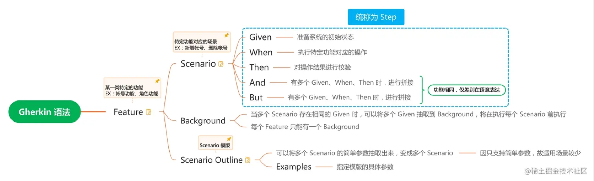

# Get Started

## Cucumber

Cucumber is a tool that supports Behaviour-Driven Development(BDD).

Cucumber 是 BDD（Behavior-Driven Development，行为驱动开发）的一个自动化测试工具，使用自然语言来描述测试用例，使得
非研发（QA、PM）也可以理解甚至编写 测试用例。

## Gherkin

Gherkin is a set of grammar rules that makes plain text structured enough for Cucumber to
understand.

Gherkin 是 Cucumber 用来描述 测试用例 的语言，以下为关键字的用意与关联关系。

### Step Definitions

Step definitions connect Gherkin steps to programming code.

### Keywords

The primary keywords are:

- [`Feature`](https://docs.cucumber.io/docs/gherkin/reference/#feature)
- [`Rule`](https://docs.cucumber.io/docs/gherkin/reference/#rule) (as of Gherkin 6)
- [`Example`](https://docs.cucumber.io/docs/gherkin/reference/#example) (or `Scenario`)
- [`Given`](https://docs.cucumber.io/docs/gherkin/reference/#given), [`When`](https://docs.cucumber.io/docs/gherkin/reference/#when), [`Then`](https://docs.cucumber.io/docs/gherkin/reference/#then), [`And`](https://docs.cucumber.io/docs/gherkin/reference/#and-but), [`But`](https://docs.cucumber.io/docs/gherkin/reference/#and-but)
  for steps (or [`*`](https://docs.cucumber.io/docs/gherkin/reference/#Asterisk))
- [`Background`](https://docs.cucumber.io/docs/gherkin/reference/#background)
- [`Scenario Outline`](https://docs.cucumber.io/docs/gherkin/reference/#scenario-outline) (
  or [`Scenario Template`](https://docs.cucumber.io/docs/gherkin/reference/#scenario-outline))
- [`Examples`](https://docs.cucumber.io/docs/gherkin/reference/#examples) (
  or [`Scenarios`](https://docs.cucumber.io/docs/gherkin/reference/#examples))

There are a few secondary keywords as well:

- `"""` (Doc Strings)
- `|` (Data Tables)
- `@` (Tags)
- `#` (Comments)

#### Feature

The purpose of the `Feature` keyword is to provide a high-level description of a software feature,
and to group related scenarios.

The first primary keyword in a Gherkin document must always be `Feature`, followed by a `:` and a
short text that describes the feature.

You can add free-form text underneath `Feature` to add more description.

These description lines are ignored by Cucumber at runtime, but are available for reporting (they
are included by reporting tools like the official HTML formatter).

Free-form descriptions (as described above for `Feature`) can also be placed
underneath `Example`/`Scenario`, `Background`, `Scenario Outline` and `Rule`.

You can write anything you like, as long as no line starts with a keyword.

Descriptions can be in the form of Markdown - formatters including the official HTML formatter
support this.

#### Rule

The (optional) `Rule` keyword has been part of Gherkin since v6.

The purpose of the `Rule` keyword is to represent one *business rule* that should be implemented. It
provides additional information for a feature. A `Rule` is used to group together several scenarios
that belong to this *business rule*. A `Rule` should contain one or more scenarios that illustrate
the particular rule.

#### Example (or Scenario)

This is a *concrete example* that *illustrates* a business rule. It consists of a list
of [steps](https://docs.cucumber.io/docs/gherkin/reference/#steps).

The keyword `Scenario` is a synonym of the keyword `Example`.

You can have as many steps as you like, but we recommend 3-5 steps per example. Having too many
steps will cause the example to lose its expressive power as a specification and documentation.

In addition to being a specification and documentation, an example is also a *test*. As a whole,
your examples are an *executable specification* of the system.

Examples follow this same pattern:

- Describe an initial context (`Given` steps)
- Describe an event (`When` steps)
- Describe an expected outcome (`Then` steps)

#### Steps

Each step starts with `Given`, `When`, `Then`, `And`, or `But`.

Cucumber executes each step in a scenario one at a time, in the sequence you’ve written them in.
When Cucumber tries to execute a step, it looks for a matching step definition to execute.

Keywords are not taken into account when looking for a step definition. This means you cannot have
a `Given`, `When`, `Then`, `And` or `But` step with the same text as another step.

#### Background

Occasionally you’ll find yourself repeating the same `Given` steps in all of the scenarios in
a `Feature`.

Since it is repeated in every scenario, this is an indication that those steps are not *essential*
to describe the scenarios; they are *incidental details*. You can literally move such `Given` steps
to the background, by grouping them under a `Background` section.

A `Background` allows you to add some context to the scenarios that follow it. It can contain one or
more `Given` steps, which are run before *each* scenario, but after
any [Before hooks](https://docs.cucumber.io/docs/cucumber/api/#hooks).

A `Background` is placed before the first `Scenario`/`Example`, at the same level of indentation.

#### Scenario Outline

The `Scenario Outline` keyword can be used to run the same `Scenario` multiple times, with different
combinations of values.

The keyword `Scenario Template` is a synonym of the keyword `Scenario Outline`.

### Step Arguments

#### Cucumber Expressions

Cucumber supports
both [Cucumber Expressions](https://github.com/cucumber/cucumber-expressions#readme) and Regular
Expressionsfor defining [Step Definitions](https://cucumber.io/docs/cucumber/step-definitions), but
you cannot mix Cucumber Expression syntax with Regular Expression syntax in the same expression.

Cucumber 支持在 Java 注解 中使用 {类型} 作为占位符。

在 Step 中直接写上参数，将在 Java 代码中，会把占位符对应的参数作为方法参数传递进去。

注解中声明占位符的顺序为注入方法参数的顺序。

字串类型的关键字，需要加上单引号或 双引号 作为声明。

| 类型           | 正则                                       | 说明                                                                                                                                                                                                                                                            |
|--------------|------------------------------------------|---------------------------------------------------------------------------------------------------------------------------------------------------------------------------------------------------------------------------------------------------------------|
| {byte}       | (/\d+/) (/[0-9]+/)                  | Matches the same as `{int}`,  but converts to an 8 bit signed integer if the platform supports it.                                                                                                                                                       |
| {short}      | (/\d+/) (/[0-9]+/)                  | Matches the same as `{int}`,  but converts to a 16 bit signed integer if the platform supports it.                                                                                                                                                       |
| {int}        | (/\d+/) (/[0-9]+/)                  | Matches integers                                                                                                                                                                                                                                              |
| {long}       | (/\d+/) (/[0-9]+/)                  | Matches the same as `{int}`,  but converts to a 64 bit signed integer if the platform supports it.                                                                                                                                                       |
| {float}      | (/-?\d+\.\d+/) (/-?[0-9]+\.[0-9]+/) | Matches floats                                                                                                                                                                                                                                                |
| {double}     | (/-?\d+\.\d+/) (/-?[0-9]+\.[0-9]+/) | Matches the same as `{float}`,  but converts to a 64 bit float if the platform supports it.                                                                                                                                                              |
| {biginteger} | (/\d+/) (/[0-9]+/)                  | Matches the same as `{int}`,  but converts to a `BigInteger` if the platform supports it.                                                                                                                                                                |
| {bigdecimal} | (/-?\d+\.\d+/) (/-?[0-9]+\.[0-9]+/) | Matches the same as {float},  but converts to a BigDecimal if the platform supports it.                                                                                                                                                                  |
| {string}     | (/\".*\"/)                               | Matches single-quoted or double-quoted strings. Only the text between the quotes will be extracted.  The quotes themselves are discarded.  Empty pairs of quotes are valid  and will be matched and passed to step code as empty strings. |
| {word}       | (/\S+/)                                  | Matches words without whitespace                                                                                                                                                                                                                              |
| `{}`         | (/.*/)                                   | Anonymous, Matches anything (`/.*/`).                                                                                                                                                                                                                         |

## Hook（钩子方法）

| 注解          | 执行时机                |
|-------------|---------------------|
| @BeforeAll  | 在启动 Cucumber 时执行    |
| @Before     | 在所有 Scenario 执行之前执行 |
| @BeforeStep | 在所有 Step 执行之前执行     |
| @AfterStep  | 在所有 Step 执行之后执行     |
| @After      | 在所有 Scenario 执行之后执行 |
| @AfterAll   | 在结束 Cucumber 时执行    |

# IDEA cucumber support

IDEA插件：

* Cucumber for Java

* Cucumber +

# Related links

[https://docs.cucumber.io/docs/guides/](https://docs.cucumber.io/docs/guides/)

[https://docs.cucumber.io/docs/gherkin/reference/](https://docs.cucumber.io/docs/gherkin/reference/)

[https://github.com/cucumber/cucumber-expressions#readme](https://github.com/cucumber/cucumber-expressions#readme)

[https://cucumber.io/docs/cucumber/configuration/?lang=java#type-registry](https://cucumber.io/docs/cucumber/configuration/?lang=java#type-registry)

[https://github.com/cucumber](https://github.com/cucumber)

[https://github.com/cucumber/cucumber-jvm/tree/main/cucumber-junit-platform-engine](https://github.com/cucumber/cucumber-jvm/tree/main/cucumber-junit-platform-engine)

[https://chromedriver.chromium.org/downloads](https://chromedriver.chromium.org/downloads)

[https://www.jetbrains.com/help/idea/2023.3/cucumber-support.html](https://www.jetbrains.com/help/idea/2023.3/cucumber-support.html)
